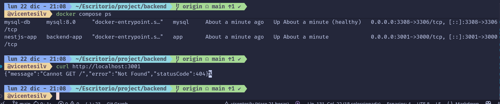

# backend de la aplicacion de hoteles

nota: cuando clonen el repositorio recuerden ejecutar npm install para instalar todas las dependencias necesarias.

## indice

- [configuracion de dependencias](#configuracion-de-dependencias)
- [configuracion de la estructura de carpetas](#configuracion-de-la-structura-de-carpetas)
- [dockerizacion del proyecto](#dockerizacion-del-proyecto)
- [base de datos mysql](#base-de-datos-mysql) ]
- [configuracion de gitignore](#configuracion-de-gitignore)
- [primer reporte de ejecucion](#primer-reporte-de-ejecucion)
- [lista de tareas por hacer](tareas_README.md)

## configuracion de dependencias

``` bash
npm install @nestjs/jwt @nestjs/passport passport passport-jwt bcrypt
npm install @nestjs/config
npm install typeorm @netsjs/typeorm mysql2
```

- @nestjs/jwt: Para manejar la autenticacion basada en JWT.
- @nestjs/passport: Integracion de Passport con NestJS.
- passport: Middleware de autenticacion.
- passport-jwt: Estrategia de Passport para autenticar usando JWT.
- bcrypt: Para encriptar contraseñas de forma segura.
- @nestjs/config: Para manejar configuraciones de entorno y variables de configuracion.
- typeorm: ORM para interactuar con bases de datos relacionales.
- @nestjs/typeorm: Integracion de TypeORM con NestJS.
- mysql2: Cliente MySQL para Node.js, necesario para conectar con bases de datos MySQL.

por parte de las dependencias de momento son todas con el tiempo puede que agreguemos mas dependencias segun las necesidades del proyecto.

## configuracion de la structura de carpetas

```bash
src/
├── main.ts
├── app.module.ts
│
├── config/
│   └── ormconfig.ts
│
├── common/
│   ├── guards/
│   │   └── jwt-auth.guard.ts
│   ├── interceptors/
│   └── filters/
│
├── auth/
│   ├── auth.module.ts
│   ├── auth.service.ts
│   ├── auth.controller.ts
│   ├── jwt.strategy.ts
│   ├── local.strategy.ts
│   ├── dto/
│   │   ├── login.dto.ts
│   │   └── register.dto.ts
│
├── users/
│   ├── user.entity.ts
│   ├── users.module.ts
│   ├── users.service.ts
│   ├── users.controller.ts
│   └── dto/
│       └── update-user.dto.ts
│
├── hoteles/
│   ├── hotel.entity.ts
│   ├── habitaciones.entity.ts
│   ├── reservas.entity.ts
│   ├── hoteles.module.ts
│   ├── hoteles.service.ts
│   ├── hoteles.controller.ts
│   └── dto/
│       ├── create-hotel.dto.ts
│       ├── create-habitacion.dto.ts
│       └── create-reserva.dto.ts
│
├── clientes/
│   ├── cliente.entity.ts
│   ├── clientes.module.ts
│   ├── clientes.service.ts
│   ├── clientes.controller.ts
│   └── dto/
│       └── update-cliente.dto.ts
│
.env
Dockerfile
docker-compose.yml

```

nota: de momento todo es preliminar y puede cambiar segun las necesidades del proyecto.

## dockerizacion del proyecto

para la dockerizacion del proyecto he creado dos archivos uno es el Dockerfile y el otro es el docker-compose.yml

### Dockerfile

contiene las instrucciones para construir la imagen de docker para la aplicacion de backend.ya sea para desarrollo o produccion.

### docker-compose.yml

 contiene la configuracion para levantar los servicios necesarios para la aplicacion, incluyendo la base de datos mysql y el servicio de backend.

con estos dos archivos podemos levantar todo el entorno de desarrollo o produccion de manera rapida y sencilla usando docker.
para levantar los servicios solo es necesario ejecutar el siguiente comando en la terminal:

```bash
docker-compose up --build
```

esto construira las imagenes necesarias y levantara los contenedores definidos en el archivo docker-compose.yml

igual a continuacion dejo una serie de comandos que se pueden usar y el para que de cada comando:

- Veroficar que estan corriendo los contenedores
```docker-compose ps```

- Desarrollo con hot-reload
 ```docker-compose up```

- Modo detached (segundo plano)
```docker-compose up -d```

- Ver logs
```docker-compose logs -f```

- Parar contenedores
```docker-compose down```

- Parar y eliminar volúmenes
```docker-compose down -v```

- Reconstruir imágenes
```docker-compose up --build```

- Producción
```docker-compose -f docker-compose.yml up --build -d```

## base de datos mysql

cabe aclarar que la base de datos mysql ya esta configurada en el archivo docker-compose.yml y en el archivo ormconfig.ts
por lo que al levantar los contenedores con docker-compose up --build se creara automaticamente sin mencionar que la contruccion de las tablas de la base de datos asi como sus columnas y relaciones se hacen automaticamente gracias a la configuracion de TypeORM en el archivo ormconfig.ts
he implementado un borrador en lenguaje sql cabe aclarar que no se usara en el proyecto es solo como guia para la construccion de las entidades en TypeORM.

el archivo sql se encuentra en la raiz del proyecto con el nombre de ```db_hoteleria.sql```

## configuracion de gitignore

he configurado el archivo .gitignore para ignorar los archivos y carpetas que no deben ser subidos al repositorio remoto como por ejemplo:

- node_modules/
```son las dependencias del proyecto pero son muy pesadas por lo que no se suben al repositorio sin mencionar que como seguridad no se suben las dependencias ya que pueden exponer vulnerabilidades```

- dist/
```son los archivos compilados del proyecto por lo que no es necesario subirlos al repositorio```

- .env
```ojo en este caso si lo subire pero sepan que usualmente no se sube ya que puede contener informacion sensible como contraseñas o claves de API```

```gitignore
# Dependencias
node_modules/
npm-debug.log*
yarn-debug.log*
yarn-error.log*
lerna-debug.log*
package-lock.json
yarn.lock

# Compilados
/dist
/build
*.js.map

# Logs
logs
*.log
npm-debug.log*
pnpm-debug.log*
yarn-debug.log*
yarn-error.log*
lerna-debug.log*

# OS
.DS_Store
Thumbs.db

# Tests
/coverage
/.nyc_output
*.lcov

# IDEs y editores
/.idea
.project
.classpath
.c9/
*.launch
.settings/
*.sublime-workspace
.vscode/*
!.vscode/settings.json
!.vscode/tasks.json
!.vscode/launch.json
!.vscode/extensions.json

# # Variables de entorno
# .env
# .env.local
# .env.development.local
# .env.test.local
# .env.production.local

# TypeScript
*.tsbuildinfo

# Temp
*.tmp
*.temp
.cache

# Docker
docker-compose.override.yml

# Misc
.eslintcache
.cache
*.seed
*.pid
*.pid.lock
.npm
```

## primer reporte de ejecucion

al ejecutar el comando ```docker-compose up --build``` se levantaron los contenedores de la aplicacion y la base de datos mysql sin ningun problema.
la aplicacion de backend esta corriendo en el puerto 3001 y la base de datos mysql en el puerto 3308 estos puertos son los que usaran nuestras maquinas locales para conectarse a los servicios corriendo en los contenedores de docker
he parado el servicio con el comando ```docker-compose down``` sin ningun problema.
y lo he vuelto a levantar con el comando ```docker-compose up -d``` en modo detached (segundo plano) sin ningun problema.ademas he verificado que los contenedores estan corriendo correctamente con el comando ```docker-compose ps``` y todo esta funcionando como se esperaba sin ningun inconveniente.ademas he verificado los logs de los contenedores con el comando ```docker-compose logs -f``` y no se reportaron errores ni advertencias.ademas verifique la conexion de la base de datos con dbgate e hice una consulta al servidor nest con curl y todo funciono correctamente.
